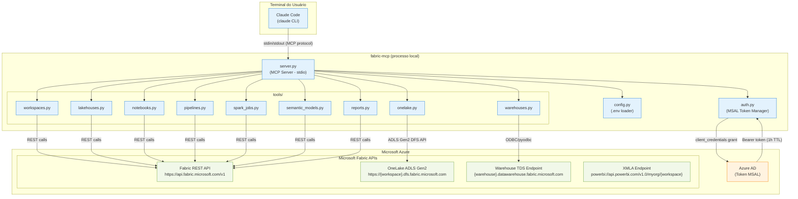
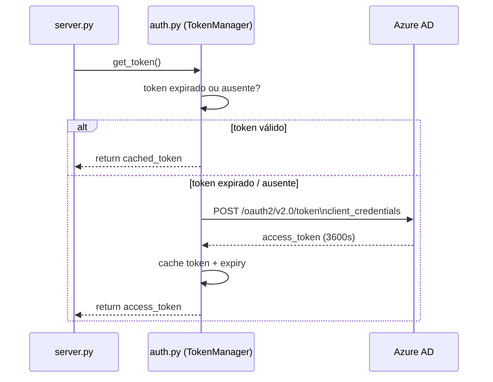
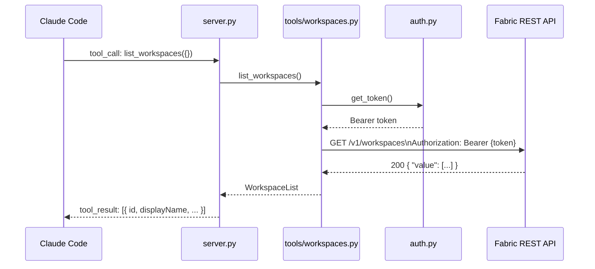

# SDD — fabric-mcp
## Software Design Document

**Projeto:** fabric-mcp  
**Versão:** 1.0.0  
**Autor:** Luciano Borba  
**Data:** 2026-04-09  
**Status:** Draft

---

## 1. Objetivo

Construir um servidor MCP (Model Context Protocol) em Python que expõe as APIs REST do Microsoft Fabric como ferramentas invocáveis por agentes de IA (Claude Code, GitHub Copilot, Cursor).

O objetivo é permitir que qualquer ação dentro do Microsoft Fabric — criar workspaces, lakehouses, notebooks, modelos semânticos, relatórios, executar queries DAX/SQL, gerenciar pipelines — seja realizada **inteiramente via terminal do Claude Code**, sem acesso ao portal do Fabric.

---

## 2. Escopo

### Inclui
- Autenticação via **Service Principal** (client_id + client_secret + tenant_id)
- Auto-refresh de token via MSAL (sem intervenção humana)
- Tools MCP cobrindo: Workspaces, Lakehouses, Warehouses, Notebooks, Pipelines, Spark Jobs, Semantic Models, Reports, OneLake
- Transporte: **stdio** (processo local, sem OAuth remoto)
- Configuração via `.env`

### Não inclui (v1.0)
- Autenticação interativa (device code, browser)
- Suporte a Dataflows Gen2
- Suporte a Eventhouses / KQL Databases
- Deploy em container ou servidor remoto
- Gestão de capacidades Fabric

---

## 3. Arquitetura

### 3.1 Visão geral



### 3.2 Fluxo de autenticação



### 3.3 Fluxo de uma tool call



---

## 4. Estrutura de Pastas

```
mcp_fabric/
├── server.py                  # Entry point — MCP Server (stdio)
├── auth.py                    # TokenManager via MSAL (Service Principal)
├── config.py                  # Carrega .env, valida variáveis obrigatórias
├── client.py                  # HTTP client base (httpx + retry + error mapping)
├── exceptions.py              # FabricAPIError, AuthError, NotFoundError, etc.
├── tools/
│   ├── __init__.py
│   ├── workspaces.py          # 8 tools
│   ├── lakehouses.py          # 7 tools
│   ├── warehouses.py          # 5 tools
│   ├── notebooks.py           # 8 tools
│   ├── pipelines.py           # 6 tools
│   ├── spark_jobs.py          # 5 tools
│   ├── semantic_models.py     # 10 tools
│   ├── reports.py             # 8 tools
│   └── onelake.py             # 6 tools
├── docs/
│   ├── SDD.md                 # Este arquivo
│   ├── arch/
│   │   ├── context.mmd
│   │   ├── container.mmd
│   │   └── data-flow.mmd
│   └── adr/
│       ├── 0001-msal-service-principal.md
│       ├── 0002-httpx-async.md
│       ├── 0003-stdio-transport.md
│       └── 0004-pyodbc-warehouse.md
├── tests/
│   ├── test_auth.py
│   ├── test_workspaces.py
│   └── test_semantic_models.py
├── .env.example               # Template de variáveis de ambiente
├── requirements.txt
└── README.md
```

---

## 5. Configuração

### 5.1 Variáveis de ambiente (.env)

```env
# Obrigatório — Service Principal
FABRIC_TENANT_ID=xxxxxxxx-xxxx-xxxx-xxxx-xxxxxxxxxxxx
FABRIC_CLIENT_ID=xxxxxxxx-xxxx-xxxx-xxxx-xxxxxxxxxxxx
FABRIC_CLIENT_SECRET=your_client_secret_here

# Opcional — workspace padrão (evita passar workspace_id em toda tool call)
FABRIC_DEFAULT_WORKSPACE_ID=xxxxxxxx-xxxx-xxxx-xxxx-xxxxxxxxxxxx

# Opcional — URL base (padrão: https://api.fabric.microsoft.com/v1)
FABRIC_API_BASE_URL=https://api.fabric.microsoft.com/v1

# Opcional — timeout em segundos (padrão: 60)
FABRIC_REQUEST_TIMEOUT=60

# Opcional — log level (DEBUG, INFO, WARNING, ERROR)
LOG_LEVEL=INFO
```

### 5.2 Permissões necessárias no Service Principal

No portal do Azure AD, o Service Principal precisa das seguintes permissões de aplicação no Fabric:

| Permissão | Tipo | Uso |
|-----------|------|-----|
| `Workspace.ReadWrite.All` | Application | Criar/listar/deletar workspaces |
| `Item.ReadWrite.All` | Application | CRUD de todos os itens Fabric |
| `Dataset.ReadWrite.All` | Application | Semantic Models (refresh, DAX) |
| `Report.ReadWrite.All` | Application | Criar/clonar/exportar relatórios |

Além disso, no portal do Fabric:
- Tenant Setting: **"Service principals can use Fabric APIs"** → Habilitado
- O Service Principal deve ter papel de **Member** ou **Admin** nos workspaces alvo

---

## 6. Catalog de Tools MCP

### 6.1 Workspaces (8 tools)

| Tool | Método HTTP | Endpoint |
|------|-------------|----------|
| `list_workspaces` | GET | `/v1/workspaces` |
| `get_workspace` | GET | `/v1/workspaces/{workspaceId}` |
| `create_workspace` | POST | `/v1/workspaces` |
| `update_workspace` | PATCH | `/v1/workspaces/{workspaceId}` |
| `delete_workspace` | DELETE | `/v1/workspaces/{workspaceId}` |
| `assign_to_capacity` | POST | `/v1/workspaces/{workspaceId}/assignToCapacity` |
| `list_role_assignments` | GET | `/v1/workspaces/{workspaceId}/roleAssignments` |
| `add_role_assignment` | POST | `/v1/workspaces/{workspaceId}/roleAssignments` |

### 6.2 Lakehouses (7 tools)

| Tool | Método HTTP | Endpoint |
|------|-------------|----------|
| `list_lakehouses` | GET | `/v1/workspaces/{workspaceId}/lakehouses` |
| `get_lakehouse` | GET | `/v1/workspaces/{workspaceId}/lakehouses/{lackhouseId}` |
| `create_lakehouse` | POST | `/v1/workspaces/{workspaceId}/lakehouses` |
| `delete_lakehouse` | DELETE | `/v1/workspaces/{workspaceId}/lakehouses/{lackhouseId}` |
| `list_lakehouse_tables` | GET | `/v1/workspaces/{workspaceId}/lakehouses/{lackhouseId}/tables` |
| `load_table` | POST | `/v1/workspaces/{workspaceId}/lakehouses/{lackhouseId}/tables/{tableName}/load` |
| `run_table_maintenance` | POST | `/v1/workspaces/{workspaceId}/lakehouses/{lackhouseId}/tables/{tableName}/maintenance` |

### 6.3 Warehouses (5 tools)

| Tool | Método HTTP | Endpoint / Protocolo |
|------|-------------|----------------------|
| `list_warehouses` | GET | `/v1/workspaces/{workspaceId}/warehouses` |
| `get_warehouse` | GET | `/v1/workspaces/{workspaceId}/warehouses/{warehouseId}` |
| `create_warehouse` | POST | `/v1/workspaces/{workspaceId}/warehouses` |
| `delete_warehouse` | DELETE | `/v1/workspaces/{workspaceId}/warehouses/{warehouseId}` |
| `execute_sql` | ODBC/pyodbc | TDS endpoint do warehouse |

### 6.4 Notebooks (8 tools)

| Tool | Método HTTP | Endpoint |
|------|-------------|----------|
| `list_notebooks` | GET | `/v1/workspaces/{workspaceId}/notebooks` |
| `get_notebook` | GET | `/v1/workspaces/{workspaceId}/notebooks/{notebookId}` |
| `create_notebook` | POST | `/v1/workspaces/{workspaceId}/notebooks` |
| `update_notebook` | PATCH | `/v1/workspaces/{workspaceId}/notebooks/{notebookId}` |
| `delete_notebook` | DELETE | `/v1/workspaces/{workspaceId}/notebooks/{notebookId}` |
| `get_notebook_definition` | POST | `/v1/workspaces/{workspaceId}/notebooks/{notebookId}/getDefinition` |
| `update_notebook_definition` | POST | `/v1/workspaces/{workspaceId}/notebooks/{notebookId}/updateDefinition` |
| `run_notebook` | POST | `/v1/workspaces/{workspaceId}/items/{notebookId}/jobs/instances` |

### 6.5 Pipelines (6 tools)

| Tool | Método HTTP | Endpoint |
|------|-------------|----------|
| `list_pipelines` | GET | `/v1/workspaces/{workspaceId}/dataPipelines` |
| `get_pipeline` | GET | `/v1/workspaces/{workspaceId}/dataPipelines/{pipelineId}` |
| `create_pipeline` | POST | `/v1/workspaces/{workspaceId}/dataPipelines` |
| `delete_pipeline` | DELETE | `/v1/workspaces/{workspaceId}/dataPipelines/{pipelineId}` |
| `run_pipeline` | POST | `/v1/workspaces/{workspaceId}/items/{pipelineId}/jobs/instances` |
| `get_job_status` | GET | `/v1/workspaces/{workspaceId}/items/{itemId}/jobs/instances/{jobInstanceId}` |

### 6.6 Spark Job Definitions (5 tools)

| Tool | Método HTTP | Endpoint |
|------|-------------|----------|
| `list_spark_jobs` | GET | `/v1/workspaces/{workspaceId}/sparkJobDefinitions` |
| `get_spark_job` | GET | `/v1/workspaces/{workspaceId}/sparkJobDefinitions/{jobId}` |
| `create_spark_job` | POST | `/v1/workspaces/{workspaceId}/sparkJobDefinitions` |
| `delete_spark_job` | DELETE | `/v1/workspaces/{workspaceId}/sparkJobDefinitions/{jobId}` |
| `run_spark_job` | POST | `/v1/workspaces/{workspaceId}/items/{jobId}/jobs/instances` |

### 6.7 Semantic Models (10 tools)

| Tool | Método HTTP | Endpoint |
|------|-------------|----------|
| `list_semantic_models` | GET | `/v1/workspaces/{workspaceId}/semanticModels` |
| `get_semantic_model` | GET | `/v1/workspaces/{workspaceId}/semanticModels/{modelId}` |
| `create_semantic_model` | POST | `/v1/workspaces/{workspaceId}/semanticModels` |
| `delete_semantic_model` | DELETE | `/v1/workspaces/{workspaceId}/semanticModels/{modelId}` |
| `get_semantic_model_definition` | POST | `/v1/workspaces/{workspaceId}/semanticModels/{modelId}/getDefinition` |
| `update_semantic_model_definition` | POST | `/v1/workspaces/{workspaceId}/semanticModels/{modelId}/updateDefinition` |
| `refresh_semantic_model` | POST | `/v1/workspaces/{workspaceId}/semanticModels/{modelId}/refresh` |
| `get_refresh_history` | GET | `/v1/workspaces/{workspaceId}/semanticModels/{modelId}/refreshes` |
| `execute_dax` | POST | `/v1/workspaces/{workspaceId}/semanticModels/{modelId}/executeQueries` |
| `get_datasources` | GET | `/v1/workspaces/{workspaceId}/semanticModels/{modelId}/datasources` |

### 6.8 Reports (8 tools)

| Tool | Método HTTP | Endpoint |
|------|-------------|----------|
| `list_reports` | GET | `/v1/workspaces/{workspaceId}/reports` |
| `get_report` | GET | `/v1/workspaces/{workspaceId}/reports/{reportId}` |
| `create_report` | POST | `/v1/workspaces/{workspaceId}/reports` |
| `delete_report` | DELETE | `/v1/workspaces/{workspaceId}/reports/{reportId}` |
| `get_report_definition` | POST | `/v1/workspaces/{workspaceId}/reports/{reportId}/getDefinition` |
| `update_report_definition` | POST | `/v1/workspaces/{workspaceId}/reports/{reportId}/updateDefinition` |
| `clone_report` | POST | `/v1/workspaces/{workspaceId}/reports/{reportId}/clone` |
| `export_report` | POST | `/v1/workspaces/{workspaceId}/reports/{reportId}/ExportTo` |

### 6.9 OneLake (6 tools)

| Tool | Protocolo | Endpoint |
|------|-----------|----------|
| `list_onelake_files` | ADLS Gen2 DFS | `GET /{filesystem}/{path}?resource=filesystem` |
| `upload_file` | ADLS Gen2 DFS | `PUT /{filesystem}/{path}` |
| `download_file` | ADLS Gen2 DFS | `GET /{filesystem}/{path}` |
| `delete_file` | ADLS Gen2 DFS | `DELETE /{filesystem}/{path}` |
| `create_folder` | ADLS Gen2 DFS | `PUT /{filesystem}/{path}?resource=directory` |
| `get_file_properties` | ADLS Gen2 DFS | `HEAD /{filesystem}/{path}` |

**Endpoint base OneLake:** `https://{workspaceName}.dfs.fabric.microsoft.com`

---

## 7. Módulos — Responsabilidades

### 7.1 `server.py`
- Inicializa o servidor MCP usando `mcp` SDK
- Registra todas as tools dos módulos em `tools/`
- Gerencia o loop stdio (stdin → tool dispatch → stdout)
- Inicia o `TokenManager` na inicialização
- Trata erros não capturados e retorna `tool_result` com erro estruturado

### 7.2 `auth.py — TokenManager`
- Usa `msal.ConfidentialClientApplication`
- Scope: `https://api.fabric.microsoft.com/.default`
- Cache em memória com verificação de expiração (renova 5 minutos antes)
- Thread-safe para chamadas paralelas
- Lança `AuthError` se as credenciais forem inválidas

### 7.3 `client.py — FabricClient`
- Wrapper sobre `httpx.AsyncClient`
- Injeta header `Authorization: Bearer {token}` em cada request
- Retry com backoff exponencial (3 tentativas) para erros 429 e 503
- Mapeia status codes HTTP para exceções tipadas:
  - 400 → `ValidationError`
  - 401 → `AuthError`
  - 403 → `PermissionError`
  - 404 → `NotFoundError`
  - 429 → `RateLimitError` (com retry)
  - 500/503 → `FabricAPIError`
- Long-running operations: polling automático em operações com `202 Accepted` + `Location` header

### 7.4 `config.py`
- Carrega `.env` via `python-dotenv`
- Valida que `FABRIC_TENANT_ID`, `FABRIC_CLIENT_ID`, `FABRIC_CLIENT_SECRET` estão presentes
- Expõe `settings` como objeto singleton

---

## 8. Dependências Python

```txt
# requirements.txt
mcp>=1.0.0                    # MCP SDK (Anthropic)
msal>=1.28.0                  # Microsoft Authentication Library
httpx>=0.27.0                 # HTTP client async
python-dotenv>=1.0.0          # Carrega .env
pyodbc>=5.1.0                 # SQL para Warehouse (TDS endpoint)
azure-storage-file-datalake>=12.14.0  # OneLake ADLS Gen2
pydantic>=2.0.0               # Validação de inputs das tools
tenacity>=8.2.0               # Retry com backoff
```

---

## 9. Tratamento de Erros

### 9.1 Estratégia

Cada tool deve:
1. Validar inputs com Pydantic antes de chamar a API
2. Capturar exceções do `FabricClient` e retornar `ToolResult` estruturado
3. Nunca deixar um stacktrace bruto chegar ao Claude Code

### 9.2 Formato de erro retornado ao Claude Code

```json
{
  "success": false,
  "error": {
    "code": "NOT_FOUND",
    "message": "Workspace 'abc-123' não encontrado.",
    "details": "HTTP 404 — workspaceId: abc-123",
    "suggestion": "Use list_workspaces para ver os IDs disponíveis."
  }
}
```

### 9.3 Long-running operations

Operações como `refresh_semantic_model`, `run_notebook`, `run_pipeline`, `run_spark_job` retornam `202 Accepted` com um `Location` header. O `FabricClient` deve:
1. Fazer polling no `Location` a cada 5 segundos
2. Retornar status intermediário como tool result parcial
3. Timeout configurável via `FABRIC_OPERATION_TIMEOUT` (padrão: 300s)

---

## 10. Configuração no Claude Code

### 10.1 Registro do MCP server

```bash
claude mcp add fabric -- python D:/ProjetosGravacao/skills-for-fabric/mcp_fabric/server.py
```

Ou via `.claude.json` local:

```json
{
  "mcpServers": {
    "fabric": {
      "command": "python",
      "args": ["D:/ProjetosGravacao/skills-for-fabric/mcp_fabric/server.py"],
      "env": {
        "FABRIC_TENANT_ID": "seu-tenant-id",
        "FABRIC_CLIENT_ID": "seu-client-id",
        "FABRIC_CLIENT_SECRET": "seu-client-secret"
      }
    }
  }
}
```

### 10.2 Verificação

```bash
claude mcp list
# fabric: python server.py (stdio) - ✓ Connected
```

---

## 11. ADRs (Architectural Decision Records)

### ADR-0001: MSAL para autenticação via Service Principal
**Decisão:** Usar `msal.ConfidentialClientApplication` com `client_credentials` grant.  
**Motivo:** É o padrão Microsoft para autenticação server-to-server sem usuário humano. Suporta cache de token nativo.  
**Alternativas rejeitadas:** `azure-identity` (mais pesado), `requests` manual (sem cache).

### ADR-0002: httpx assíncrono
**Decisão:** Usar `httpx.AsyncClient` para todas as chamadas REST.  
**Motivo:** O MCP SDK opera de forma assíncrona. `requests` (síncrono) bloquearia o event loop.  
**Alternativas rejeitadas:** `aiohttp` (API menos ergonômica), `requests` (bloqueante).

### ADR-0003: Transporte stdio
**Decisão:** Usar stdio como transporte MCP em vez de HTTP remoto.  
**Motivo:** Elimina todos os problemas de autenticação OAuth interativo que encontramos com o endpoint remoto da Microsoft. O processo local injeta o token diretamente.  
**Alternativas rejeitadas:** HTTP remoto com `--client-id` (falhou por incompatibilidade de OAuth dynamic client registration).

### ADR-0004: pyodbc para Warehouse SQL
**Decisão:** Usar `pyodbc` com driver ODBC para o endpoint TDS do Fabric Warehouse.  
**Motivo:** O Fabric Warehouse expõe um endpoint TDS (SQL Server), não um REST endpoint para execução de queries.  
**Alternativas rejeitadas:** API REST (não existe para execução de SQL no Warehouse).

---

## 12. Limitações Conhecidas da API do Fabric

| Limitação | Impacto | Workaround |
|-----------|---------|-----------|
| Rate limit: 200 req/min por workspace | Tools podem falhar com 429 | Retry automático com backoff |
| Criação de relatório via API requer PBIX em base64 | Não é possível criar relatório do zero via API | Usar clone_report de um template |
| Notebook definition usa formato Jupyter (.ipynb) em base64 | Conteúdo do notebook deve ser enviado codificado | Helper de encoding no client |
| Refresh de semantic model é assíncrono | `refresh_semantic_model` retorna imediatamente | Polling em `get_refresh_history` |
| Service Principal não pode publicar semantic models com DirectLake via REST | Limitação da API v1 | Documentar como bloqueio conhecido |
| OneLake ADLS Gen2 usa endpoint diferente por workspace | URL não é padrão | Resolver URL via `get_workspace` antes |

---

## 13. Roadmap pós-POC

| Fase | Funcionalidade |
|------|---------------|
| v1.1 | Suporte a Eventhouses e KQL Databases |
| v1.2 | Dataflows Gen2 (criar, atualizar, executar) |
| v1.3 | Gestão de capacidades (pause, resume, scale) |
| v1.4 | Deployment Pipelines (stages, deploy, compare) |
| v2.0 | Isolamento em repositório próprio + publicação no PyPI |

---

**Author:** Luciano Borba / fabric-mcp  
**Version:** 1.0.0  
**Data:** 2026-04-09
